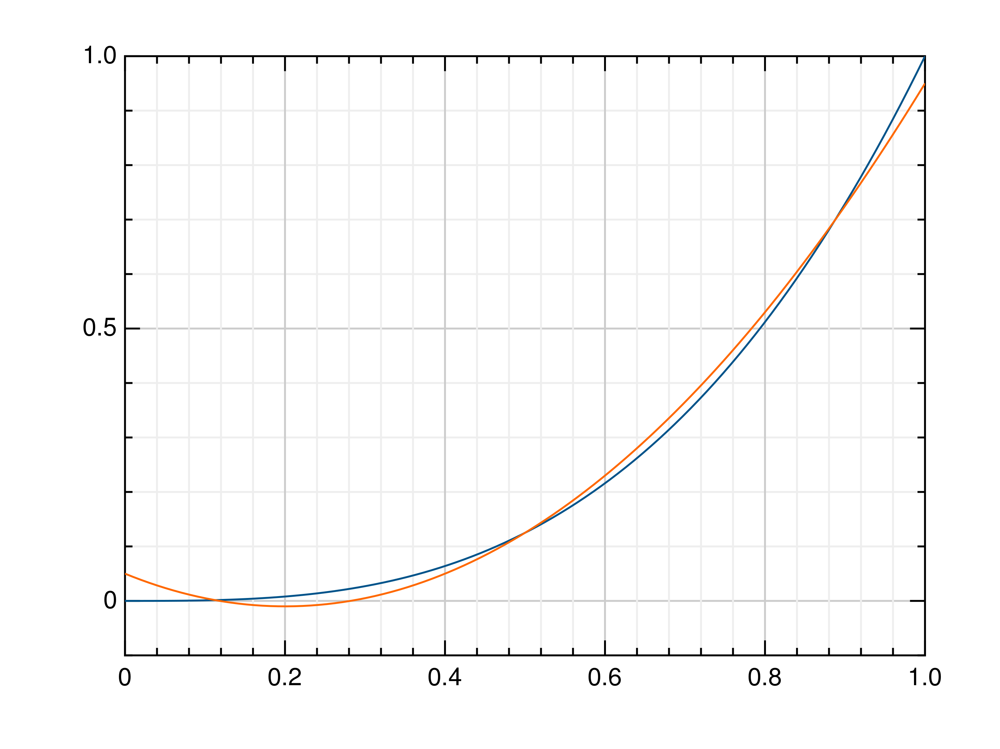


# Aproximace funkcí v Hilbertově prostoru

Symbol $I$ označuje otevřený interval $I=(a,b)$ a $f \in L_2(I)$.

## Ortogonální projekce

Nechť $V \subset L_2(I)$ je konečně dimenzionální podprostor. Hledáme funkci $Pf \in V$ tak aby

$$
\int_I (f-Pf)v=0 \quad \forall \ \in V
$$

Nechť $B=\{\varphi_i\}_{i=1}^n$ je báze $V$ stačí

$$
\int_I (f-Pf)\varphi_i=0 \quad \text{ pro } i=1 \dots n
$$

a když vyjádříme $Pf=\sum_{j=1}^n c_j \varphi_j$ a dosadíme

$$
\int_I (f-\sum_{j=1}^n c_j \varphi_j)\varphi_i=0 \quad \text{ pro } i=1 \dots n, \\
\sum_{j=1}^n \int_I \varphi_j \varphi_i c_j =\int_I f \varphi_i \quad \text{ pro } i=1 \dots n
$$

Zapsáno maticově

$$
Mc=b,
$$

kde $M=\left[ \int_I \varphi_i \varphi_j \right]$ a $b=\left\{ \int_I f \varphi_i \right\}$.

## Globální polynomy

Za prostor $V$ zvolíme $n+1$ dimenzionální prostor $P_n$ s monickou bází

$$B=\left\{ x^{i-1} : \quad i=1 \dots n+1 \right\}. $$

Obecná funkce $f \in P_n$ je polynom $n$-tého stupně 

$$f=c_{n+1}x^n+ \dots +c_1.$$

## Implementace

Matice hmotností má elementy

$$
m_{ij}=\int_I x^{i-1} x^{j-1}dx=\frac{1}{i+j-1} \left[ x^{i+j-1}\right]_a^b
$$,

pro interval $I=(0,1)$ a kvadratické polynomy můžeme vypsat explicitně

$$
M= \left[ \begin {array}{ccc} 1&1/2&1/3\\ 1/2&1/3&1/4
\\ 1/3&1/4&1/5\end {array} \right]
$$

Vektor zatížení má pro $f=x^k$ elementy

$$
b_{i}=\int_I x^{i-1} x^k dx=\frac{1}{i+k} \left[ x^{i+k}\right]_a^b
$$,

Jaká je tedy aproximace $f=x^3$ na $I=(0,1)$?

$$
b=\left[ \begin {array}{c} 1/4\\ 1/5
\\ 1/6\end {array} \right]
$$

Řešením je

$$
Px^3=1.5x^2-0.6x+0.05
$$

