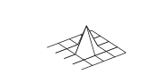

# Metoda konečných prvků

## Klasická formulace

Uvažujme Poissonovu rovnici v ohraničené oblasti $\Omega  \subset \mathbb{R}^2$

$$ \begin{aligned} 
-\frac{\partial^2 u(x,y)}{\partial x^2}-\frac{\partial^2 u(x,y)}{\partial y^2} & = f(x,y) \text{ v } \Omega 
\\ u & = 0 \text{ na } \Gamma_D 
\end{aligned}$$ (1)

## Slabá variační formulace

Rovnici (1) vynásobíme testovací funkcí $v \in V$, kde 

$$ V=\{v \in C(\bar{\Omega} ):\, v=0 \text{ na } \Gamma_D \} $$ (2)

a použijeme Gaussovu větu

$$ \int_\Omega\nabla u\nabla v \, d\Omega =\int_\Omega fv \, d\Omega$$ (3)

Definujeme

$$a(u,v):= \int_\Omega\nabla u\nabla v \, d\Omega
\\ \langle f,v \rangle:=\int_\Omega fv \, d\Omega$$ (4)

zapíšeme kompaktně

$$ \color{red} a(u,v)=\langle f,v \rangle$$ (5)

